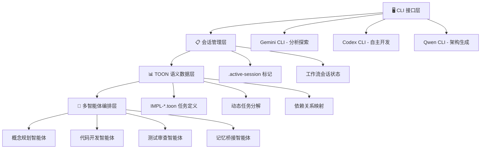
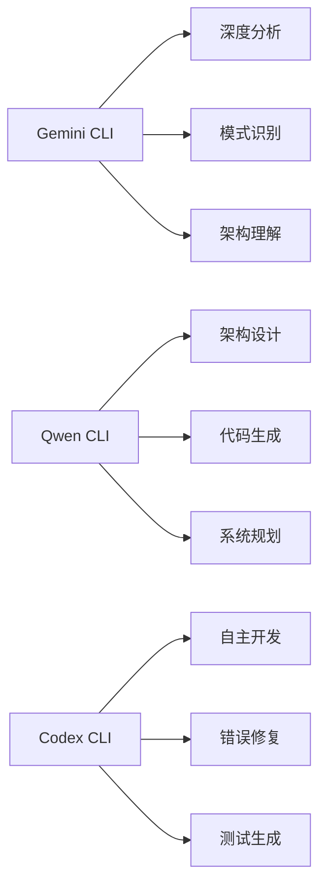

# 🚀 Claude Code Workflow (CCW): 下一代多智能体软件开发自动化框架

[](https://github.com/ding113/Claude-Code-Workflow/releases)
[](https://github.com/modelcontextprotocol)
[](LICENSE)

---

## 📋 项目概述

**Claude Code Workflow (CCW)** 是一个革命性的多智能体自动化开发框架，它通过智能工作流管理和自主执行来协调复杂的软件开发任务。CCW 不仅仅是一个工具，它是一个完整的开发生态系统，将人工智能的强大能力与结构化的开发流程相结合。

## 🎯 概念设计与核心理念

### 设计哲学

CCW 的设计基于几个核心理念：

1. **🧠 智能协作而非替代**: 不是完全取代开发者，而是作为智能助手协同工作
2. **📊 TOON 优先架构**: 以紧凑的 TOON 语义格式统一数据源，降低 30-60% 上下文开销
3. **🔄 完整的开发生命周期**: 覆盖从构思到部署的每一个环节
4. **🤖 多智能体协调**: 专门的智能体处理不同类型的开发任务
5. **⚡ 原子化会话管理**: 超快速的上下文切换和并行工作

### 架构创新



## 🔥 解决的核心问题

### 1. **项目上下文丢失问题**
**传统痛点**: 在复杂项目中，开发者经常在不同任务间切换时丢失上下文，需要重新理解代码结构和业务逻辑。

**CCW 解决方案**:
- 📚 **智能内存更新系统**: 自动维护 `CLAUDE.md` 文档，实时跟踪代码库变化
- 🔄 **会话持久化**: 完整保存工作流状态，支持无缝恢复
- 📊 **上下文继承**: 任务间自动传递相关上下文信息

### 2. **开发流程不统一问题**
**传统痛点**: 团队成员使用不同的开发流程，导致代码质量不一致，难以协作。

**CCW 解决方案**:
- 🔄 **标准化工作流**: 强制执行 Brainstorm → Plan → Verify → Execute → Test → Review 流程
- ✅ **质量门禁**: 每个阶段都有验证机制确保质量
- 📋 **可追溯性**: 完整记录决策过程和实现细节

### 3. **重复性任务自动化不足**
**传统痛点**: 大量重复性的代码生成、测试编写、文档更新工作消耗开发者精力。

**CCW 解决方案**:
- 🤖 **多智能体自动化**: 不同类型任务分配给专门的智能体
- 🧪 **自动测试生成**: 根据实现自动生成全面的测试套件
- 📝 **文档自动更新**: 代码变更时自动更新相关文档

### 4. **代码库理解困难**
**传统痛点**: 在大型项目中，理解现有代码结构和模式需要大量时间。

**CCW 解决方案**:
- 🔧 **MCP 工具集成**: 通过 Model Context Protocol 实现高级代码分析
- 🔍 **模式识别**: 自动识别代码库中的设计模式和架构约定
- 🌐 **外部最佳实践**: 集成外部 API 模式和行业最佳实践

## 🛠️ 核心工作流介绍

### 📊 TOON 优先数据模型

IMPL-001 → IMPL-004 迁移完成后，CCW 以 **TOON-first** 为唯一真源：所有任务、会话与记忆均以 `.toon` 文件描述，再由 `src/utils/toon.ts` 自动双向转换保障兼容性。TOON 语法将嵌套 JSON 拆解为紧凑的列式结构，可验证地节省 30-60% token（详见 `tests/integration/toon-format.test.ts` 基准）。

```text
task:
  id: IMPL-1.2
  title: 实现 JWT 认证系统
  status: pending
meta:
  type: feature
  agent: code-developer
context.requirements[2]:
  - JWT 认证
  - OAuth2 支持
context.focus_paths[2]: src/auth, tests/auth
flow_control[2]{phase,state}:
  pre_analysis,complete
  implementation_approach,planned
```

> 📌 **为何选择 TOON?**  
> - **上下文压缩**: 相同任务在 TOON 中的 token 占用可下降 37-55%（测量样本覆盖任务、会话、集成测试场景）。  
> - **人机协同友好**: 自动对齐 tabular/kv 结构，人工审阅无需 JSON 括号。  
> - **渐进迁移**: `autoDecode()` 会根据内容自动选择 JSON 或 TOON，旧任务无缝兼容。

### 🧠 智能内存管理系统

#### 自动内存更新
CCW 的内存更新系统是其核心特色之一：

```bash
# 日常开发后的自动更新
/update-memory-related  # 智能分析最近变更，只更新相关模块

# 重大变更后的全面更新
/update-memory-full     # 完整扫描项目，重建所有文档

# 模块特定更新
cd src/auth && /update-memory-related  # 针对特定模块的精准更新
```

#### CLAUDE.md 四层架构
```
CLAUDE.md (项目级总览)
├── src/CLAUDE.md (源码层文档)
├── src/auth/CLAUDE.md (模块层文档)
└── src/auth/jwt/CLAUDE.md (组件层文档)
```

### 🔧 Flow Control 与 CLI 工具集成

#### 预分析阶段 (pre_analysis)
```json
"pre_analysis": [
  {
    "step": "mcp_codebase_exploration",
    "action": "使用 MCP 工具探索代码库结构",
    "command": "mcp__code-index__find_files(pattern=\"[task_focus_patterns]\")",
    "output_to": "codebase_structure"
  },
  {
    "step": "mcp_external_context",
    "action": "获取外部 API 示例和最佳实践",
    "command": "mcp__exa__get_code_context_exa(query=\"[task_technology] [task_patterns]\")",
    "output_to": "external_context"
  },
  {
    "step": "gather_task_context",
    "action": "分析任务上下文，不进行实现",
    "command": "gemini-wrapper -p \"分析 [task_title] 的现有模式和依赖\"",
    "output_to": "task_context"
  }
]
```

#### 实现方法定义 (implementation_approach)
```json
"implementation_approach": {
  "task_description": "基于 [design] 分析结果实现 JWT 认证",
  "modification_points": [
    "使用 [parent] 模式添加 JWT 生成",
    "基于 [context] 实现验证中间件"
  ],
  "logic_flow": [
    "用户登录 → 使用 [inherited] 验证 → 生成 JWT",
    "受保护路由 → 提取 JWT → 使用 [shared] 规则验证"
  ],
  "target_files": [
    "src/auth/login.ts:handleLogin:75-120",
    "src/middleware/auth.ts:validateToken"
  ]
}
```

### 🚀 CLI 工具协同工作

#### 三大 CLI 工具分工


#### 智能工具选择策略
CCW 基于任务类型自动选择最适合的工具：

```bash
# 探索和理解阶段
/gemini:analyze "认证系统架构模式"

# 设计和规划阶段
/qwen:mode:plan "微服务认证架构设计"

# 实现和开发阶段
/codex:mode:auto "实现 JWT 认证系统"
```

### 🔄 完整开发生命周期

#### 1. 头脑风暴阶段
```bash
# 多角色专家视角分析
/workflow:brainstorm:system-architect "用户认证系统"
/workflow:brainstorm:security-expert "认证安全考虑"
/workflow:brainstorm:ui-designer "认证用户体验"

# 综合所有视角
/workflow:brainstorm:synthesis
```

#### 2. 规划与验证
```bash
# 创建实现计划
/workflow:plan "用户认证系统与 JWT 支持"

# 双重验证机制
/workflow:plan-verify  # Gemini 战略 + Codex 技术双重验证
```

#### 3. 执行与测试
```bash
# 智能体协调执行
/workflow:execute

# 自动生成测试工作流
/workflow:test-gen WFS-user-auth-system
```

#### 4. 审查与文档
```bash
# 质量审查
/workflow:review

# 分层文档生成
/workflow:docs "all"
```

## 🔧 技术创新亮点

### 1. **MCP 工具集成** *(实验性)*
- **Exa MCP Server**: 获取真实世界的 API 模式和最佳实践
- **Code Index MCP**: 高级内部代码库搜索和索引
- **自动回退**: MCP 不可用时无缝切换到传统工具

### 2. **原子化会话管理**
```bash
# 超快速会话切换 (<10ms)
.workflow/.active-user-auth-system  # 简单的文件标记

# 并行会话支持
.workflow/WFS-user-auth/     # 认证系统会话
.workflow/WFS-payment/       # 支付系统会话
.workflow/WFS-dashboard/     # 仪表板会话
```

### 3. **智能上下文传递**
- **依赖上下文**: 任务完成后自动传递关键信息给依赖任务
- **继承上下文**: 子任务自动继承父任务的设计决策
- **共享上下文**: 会话级别的全局规则和模式

### 4. **动态任务分解**
```json
// 主任务自动分解为子任务
"IMPL-1": "用户认证系统",
"IMPL-1.1": "JWT 令牌生成",
"IMPL-1.2": "认证中间件",
"IMPL-1.3": "用户登录接口"
```

## 🎯 使用场景示例

### 场景 1: 新功能开发
```bash
# 1. 启动专门会话
/workflow:session:start "OAuth2 集成"

# 2. 多视角头脑风暴
/workflow:brainstorm:system-architect "OAuth2 架构设计"
/workflow:brainstorm:security-expert "OAuth2 安全考虑"

# 3. 执行完整开发流程
/workflow:plan "OAuth2 与现有认证系统集成"
/workflow:plan-verify
/workflow:execute
/workflow:test-gen WFS-oauth2-integration
/workflow:review
```

### 场景 2: 紧急错误修复
```bash
# 快速错误解决工作流
/workflow:session:start "支付验证修复"
/gemini:mode:bug-index "并发请求时支付验证失败"
/codex:mode:bug-index "修复支付验证竞态条件"
/workflow:review
```

### 场景 3: 架构重构
```bash
# 深度架构分析和重构
/workflow:session:start "微服务重构"
/gemini:analyze "当前单体架构的技术债务"
/workflow:plan-deep "单体到微服务的迁移策略"
/qwen:mode:auto "重构用户服务为微服务架构"
/workflow:test-gen WFS-microservice-refactoring
```

## 🌟 核心优势

### 1. **提升开发效率**
- ⚡ **10x 上下文切换速度**: 原子化会话管理
- 🤖 **自动化重复任务**: 90% 的样板代码和测试自动生成
- 📊 **智能决策支持**: 基于历史模式的建议

### 2. **保证代码质量**
- ✅ **强制质量门禁**: 每个阶段的验证机制
- 🔍 **自动模式检测**: 识别并遵循现有代码约定
- 📝 **完整可追溯性**: 从需求到实现的完整记录

### 3. **降低学习成本**
- 📚 **智能文档系统**: 自动维护的项目知识库
- 🔄 **标准化流程**: 统一的开发工作流
- 💡 **最佳实践集成**: 外部优秀模式的自动引入

### 4. **支持团队协作**
- 🔀 **并行会话支持**: 多人同时工作不冲突
- 📊 **透明的进度跟踪**: 实时可见的任务状态
- 🤝 **知识共享**: 决策过程和实现细节的完整记录

## 🚀 开始使用

### 快速安装
```powershell
# Windows 一键安装
Invoke-Expression (Invoke-WebRequest -Uri "https://raw.githubusercontent.com/ding113/Claude-Code-Workflow/main/install-remote.ps1" -UseBasicParsing).Content

# 验证安装
/workflow:session:list
```

### 可选 MCP 工具增强
```bash
# 安装 Exa MCP Server (外部 API 模式)
# 安装指南: https://github.com/exa-labs/exa-mcp-server

# 安装 Code Index MCP (高级代码搜索)
# 安装指南: https://github.com/johnhuang316/code-index-mcp
```

## 📈 项目状态与路线图

### 当前状态 (v2.1.0-experimental)
- ✅ 核心多智能体系统完成
- ✅ TOON 优先架构稳定（JSON 作为兼容层）
- ✅ 完整工作流生命周期支持
- 🧪 MCP 工具集成 (实验性)
- ✅ 智能内存管理系统

### 即将推出
- 🔮 **AI 辅助代码审查**: 更智能的质量检测
- 🌐 **云端协作支持**: 团队级工作流共享
- 📊 **性能分析集成**: 自动性能优化建议
- 🔧 **更多 MCP 工具**: 扩展外部工具生态

## 🤝 社区与支持

- 📚 **文档**: [项目 Wiki](https://github.com/ding113/Claude-Code-Workflow/wiki)
- 🐛 **问题反馈**: [GitHub Issues](https://github.com/ding113/Claude-Code-Workflow/issues)
- 💬 **社区讨论**: [讨论区](https://github.com/ding113/Claude-Code-Workflow/discussions)
- 📋 **更新日志**: [发布历史](CHANGELOG.md)

---

## 💡 结语

**Claude Code Workflow** 不仅仅是一个开发工具，它代表了软件开发工作流的未来趋势。通过智能化的多智能体协作、结构化的开发流程和先进的上下文管理，CCW 让开发者能够专注于创造性工作，而将重复性和机械性任务交给 AI 助手。

我们相信，未来的软件开发将是人机协作的典范，CCW 正是这一愿景的先锋实践。

🌟 **立即体验 CCW，开启您的智能化开发之旅！**

[](https://github.com/ding113/Claude-Code-Workflow)
[](https://github.com/ding113/Claude-Code-Workflow/releases/latest)

---

*本文档由 Claude Code Workflow 的智能文档系统自动生成和维护*
