# Claude Code Workflow (CCW) - Enhanced Workflow Diagrams

Based on comprehensive analysis of changes since v1.0, this document provides detailed mermaid diagrams illustrating the CCW architecture and execution flows.

## 1. System Architecture Overview

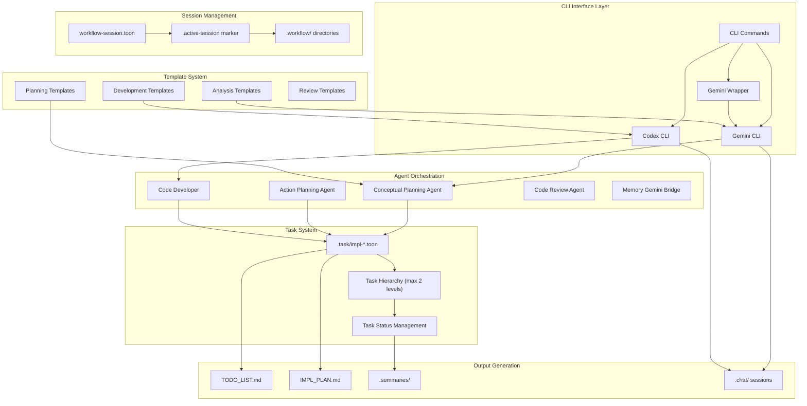

## 2. Command Execution Flow

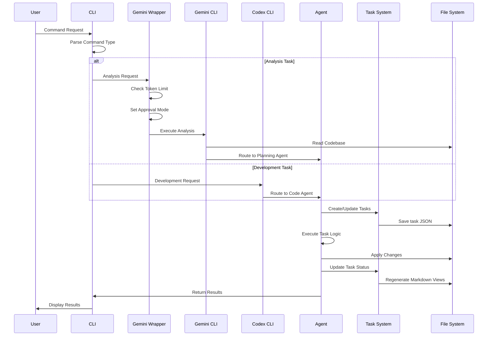

## 3. Session Management Flow

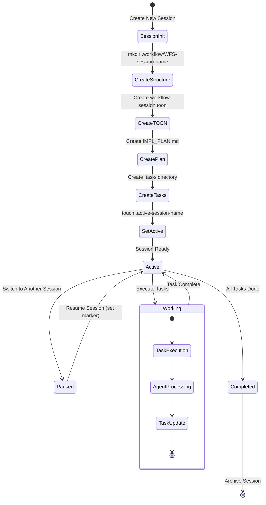

## 4. Task Lifecycle Management

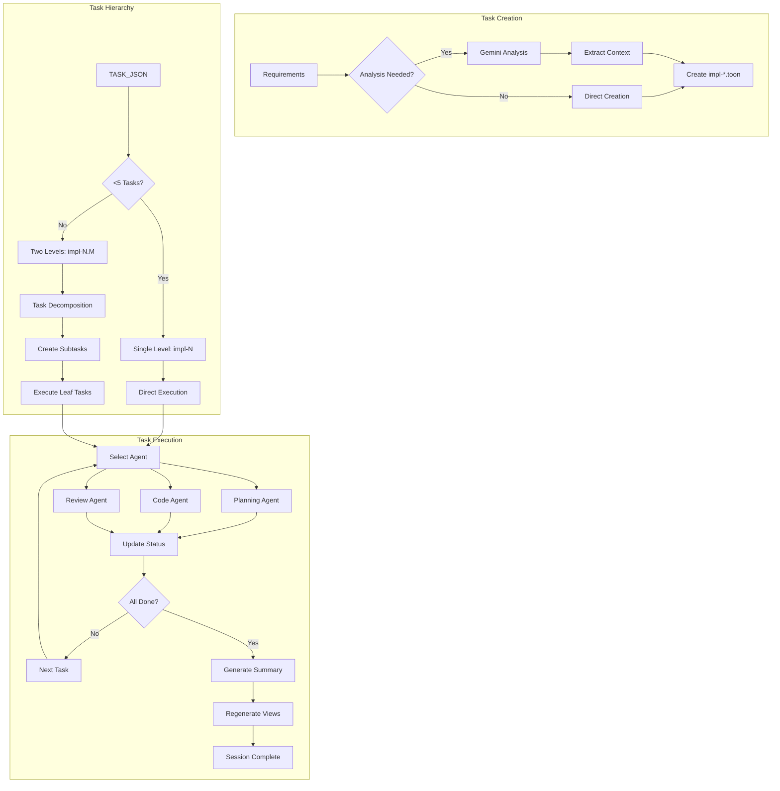

## 5. CLI Tool Integration Architecture

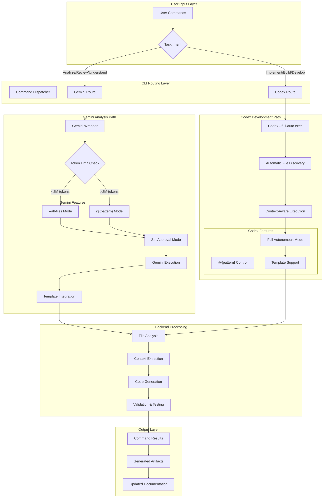

## 6. Agent Workflow Coordination

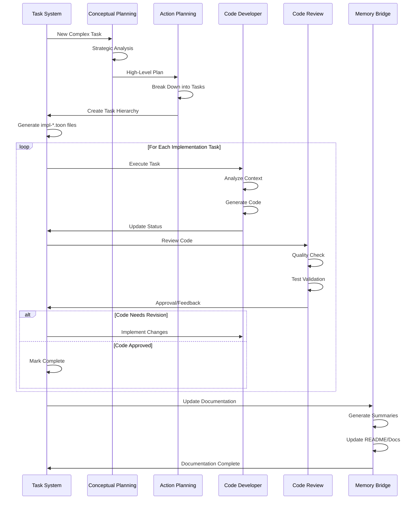

## 7. Template System Architecture

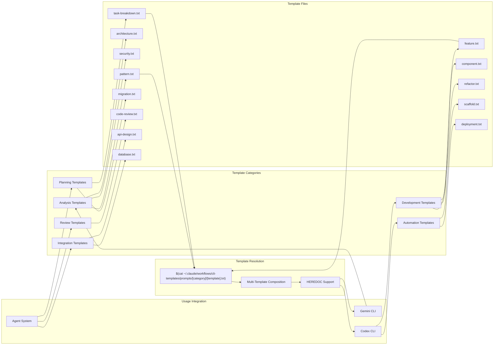

## 8. Complexity Management System

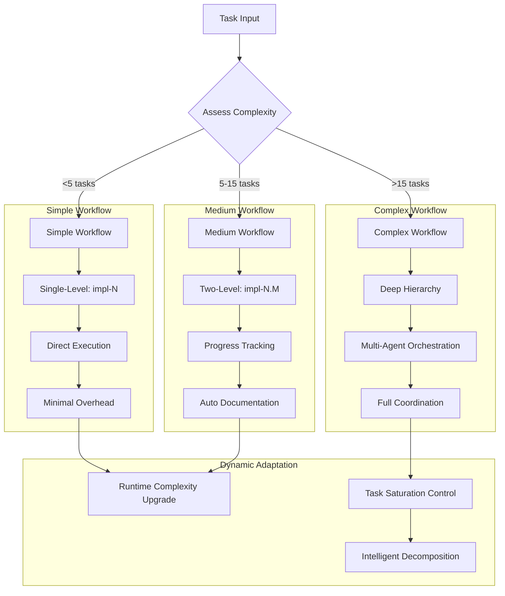

## Key Architectural Changes Since v1.0

### Major Enhancements:
1. **Intelligent Task Saturation Control**: Prevents overwhelming agents with too many simultaneous tasks
2. **Gemini Wrapper Intelligence**: Automatic token management and approval mode detection
3. **Path-Specific Analysis**: Task-specific path management for precise CLI analysis
4. **Template System Integration**: Unified template system across all CLI tools
5. **Session Context Passing**: Proper context management for agent coordination
6. **On-Demand File Creation**: Improved performance through lazy initialization
7. **Enhanced Error Handling**: Comprehensive error logging and recovery
8. **Codex Full-Auto Mode**: Maximum autonomous development capabilities
9. **Cross-Tool Template Compatibility**: Seamless template sharing between Gemini and Codex

### Performance Improvements:
- 10-minute execution timeout for complex operations
- Sub-millisecond JSON query performance
- Atomic session switching with zero overhead
- Intelligent file discovery reducing context switching

## 9. Complete Development Workflow (Workflow vs Task Commands)

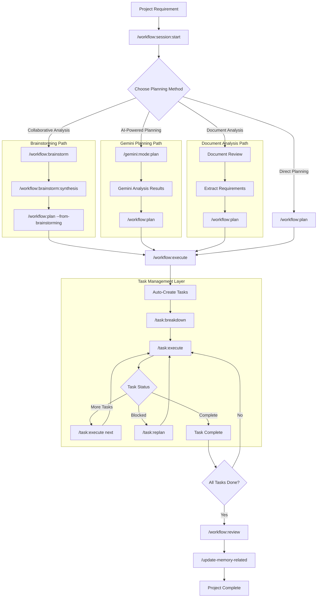

## 10. Workflow Command Relationships

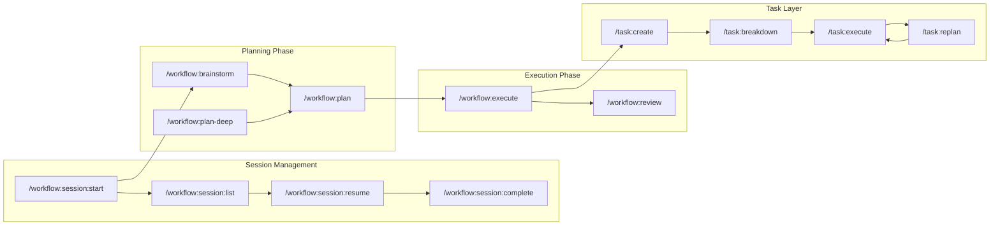

## 11. Planning Method Selection Flow

```mermaid
flowchart TD
    PROJECT_START[New Project/Feature] --> COMPLEXITY{Assess Complexity}

    COMPLEXITY -->|Simple < 5 tasks| SIMPLE_FLOW
    COMPLEXITY -->|Medium 5-15 tasks| MEDIUM_FLOW
    COMPLEXITY -->|Complex > 15 tasks| COMPLEX_FLOW

    subgraph SIMPLE_FLOW["Simple Workflow"]
        S_DIRECT["/workflow:plan (direct)"]
        S_EXECUTE["/workflow:execute --type=simple"]
        S_TASKS["Direct task execution"]

        S_DIRECT --> S_EXECUTE --> S_TASKS
    end

    subgraph MEDIUM_FLOW["Medium Workflow"]
        M_CHOICE{Planning Method?}
        M_GEMINI["/gemini:mode:plan"]
        M_DOCS["Review existing docs"]
        M_PLAN["/workflow:plan"]
        M_EXECUTE["/workflow:execute --type=medium"]
        M_BREAKDOWN["/task:breakdown"]

        M_CHOICE -->|AI Planning| M_GEMINI
        M_CHOICE -->|Documentation| M_DOCS
        M_GEMINI --> M_PLAN
        M_DOCS --> M_PLAN
        M_PLAN --> M_EXECUTE
        M_EXECUTE --> M_BREAKDOWN
    end

    subgraph COMPLEX_FLOW["Complex Workflow"]
        C_BRAINSTORM["/workflow:brainstorm --perspectives=multiple"]
        C_SYNTHESIS["/workflow:brainstorm:synthesis"]
        C_PLAN_DEEP["/workflow:plan-deep"]
        C_PLAN["/workflow:plan --from-brainstorming"]
        C_EXECUTE["/workflow:execute --type=complex"]
        C_TASKS["Hierarchical task management"]

        C_BRAINSTORM --> C_SYNTHESIS
        C_SYNTHESIS --> C_PLAN_DEEP
        C_PLAN_DEEP --> C_PLAN
        C_PLAN --> C_EXECUTE
        C_EXECUTE --> C_TASKS
    end
```

## 12. Brainstorming to Execution Pipeline

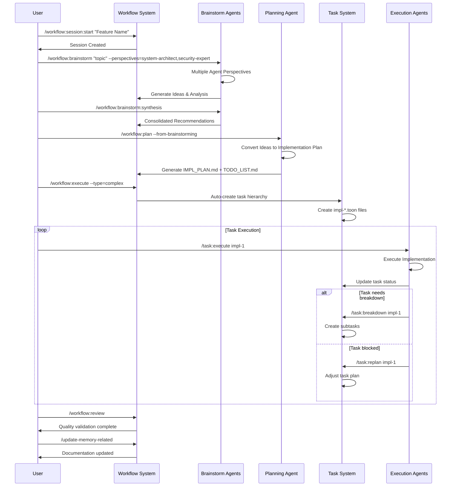

## 13. Task Command Hierarchy and Dependencies

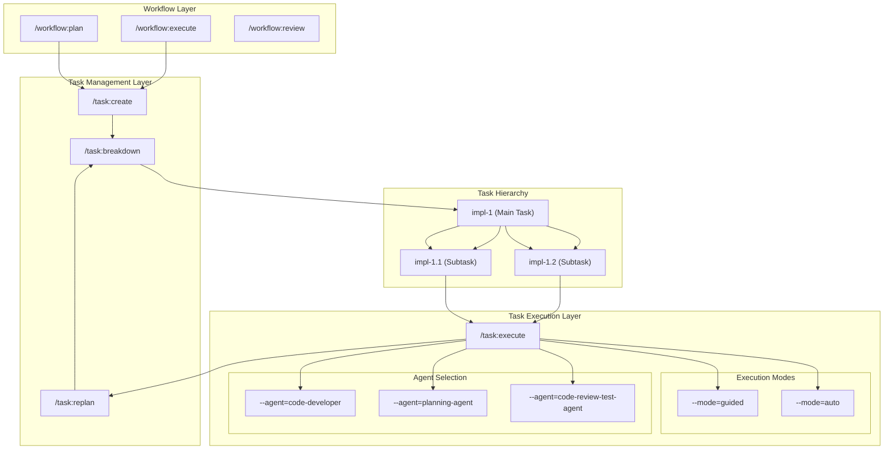

## 14. CLI Integration in Workflow Context

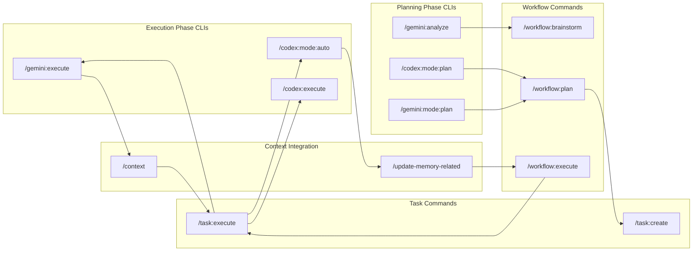